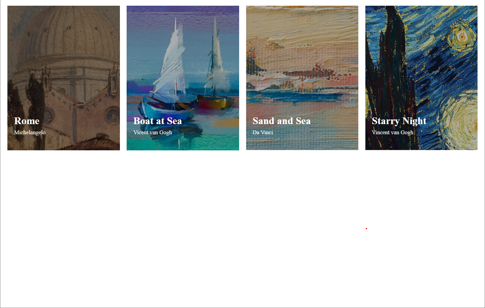
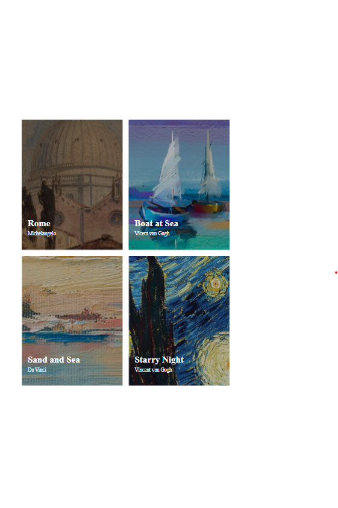
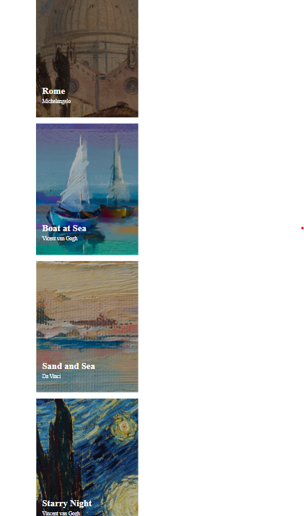

# Pictures List Page

<b>Este projeto é o resultado de um exercício do módulo de HTML e CSS, proposto pelo curso DevQuest.

## Visão Geral 

###  Projeto 

<b> O objetivo é desenvolver uma página com estrutura do tipo Pictures List, onde as imagens são organizadas em uma grade. 

###  Desafio

<b>O desafio consiste em desenvolver uma página a partir dos designs fornecidos, com estrutura do tipo Pictures List, que é um modelo de layout onde o conteúdo é organizado em uma grade. O design deve ser responsivo, adaptando-se a diferentes tamanhos de tela.

### Funcionalidades 
<ul>
<li>Design responsivo, adaptando-se a diferentes tamanhos de tela.</li>
</ul>

### Capturas de tela 

Preview - Desktop:  
  
 

Preview - Tablet:  
  

Preview - Mobile:  
  
  
   

### Links 
 
<ul>
<li><a href="https://github.com/fernanda-nunes/pictures-list-page" target="_blank"> Repositórios</a></li>
<li><a href="https://fernanda-nunes.github.io/pictures-list-page/" target="_blank"> Site ao vivo</a></li>
</ul>
 

## O que eu aprendi 

<b> Durante o desenvolvimento deste projeto, tive a oportunidade de consolidar e expandir minhas habilidades em desenvolvimento front-end.
